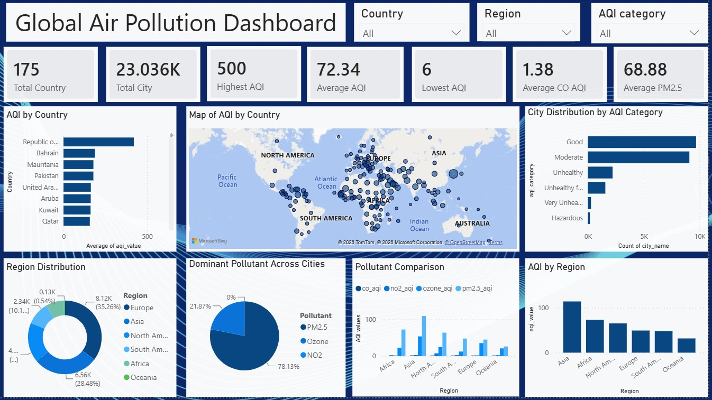

# Global Air Pollution Dashboard — Power BI

An interactive Power BI dashboard for exploring global air quality across **175 countries**, with a focus on AQI severity, regional patterns, pollutant levels, and geographic distribution.

The dashboard combines data cleaning, geographic categorization, DAX calculations, interactive filtering, and data visualization to provide a high-level view of global air pollution patterns.



---

## Dashboard Overview

The dashboard provides an interactive overview of:

- Overall air quality across countries and cities
- AQI distribution by severity category
- Geographic patterns in air pollution
- Regional differences in AQI
- Dominant pollutants across cities
- Pollutant-level comparisons between regions

### Key Metrics

The dashboard includes KPI cards for:

- **Total Countries**
- **Total Cities**
- **Highest AQI**
- **Average AQI**
- **Lowest AQI**
- **Average CO AQI**
- **Average PM2.5 AQI**

---

## Questions Answered

This dashboard was designed to answer questions such as:

- Which countries have the highest average AQI?
- Which regions experience higher levels of air pollution?
- How are cities distributed across AQI severity categories?
- Which pollutant has the highest pollutant-specific AQI in each city?
- How does the dominant pollutant vary across regions?
- Where are air pollution levels concentrated geographically?

---

## Dashboard Features

### Geographic Analysis

- Interactive map showing AQI distribution across cities worldwide
- Geographic comparison of pollution levels
- Region-based analysis across **Asia, Africa, Europe, North America, South America, and Oceania**

### AQI Analysis

- Average AQI by country
- AQI distribution across severity categories
- Regional AQI comparison
- Identification of highest and lowest AQI values

### Pollutant Analysis

The dataset contains AQI values for:

- **PM2.5**
- **NO2**
- **Ozone**
- **CO**

A custom DAX calculation identifies the pollutant with the highest AQI value for each city and classifies it as the **Dominant Pollutant**.

### Interactive Filtering

Users can filter the dashboard by:

- **Country**
- **Region**
- **AQI Category**

Visuals respond dynamically through Power BI's cross-filtering functionality.

---
## Data Source

The project started with a global air pollution dataset (`global_air_pollution_data(1).csv`) containing ~23,463 city-level air quality records across 175 countries. Fields include:

- Country and city identifiers
- Overall AQI value and category
- CO AQI value and category
- Ozone AQI value and category
- NO2 AQI value and category
- PM2.5 AQI value and category

---

## Data Preparation

The dataset was initially cleaned in Excel (data type checks, duplicate removal, dropping rows with missing country values), then further prepared and transformed within Power BI using Power Query.

Key preparation steps included:

- Checked and corrected data types
- Removed duplicate records
- Dropped rows with missing country_name, since country is a required dimension for the region/geographic analysis
- Standardized country names
- Creating a `Region` column by manually mapping countries to geographic regions using Power Query's conditional column feature
- Preparing AQI and pollutant fields for analysis

---

## DAX & Data Modeling

### Dominant Pollutant

A custom DAX measure was created to determine which pollutant has the highest pollutant-specific AQI value for each city.

```DAX
Dominant Pollutant =
SWITCH(
    TRUE(),
    [co_aqi_value] >= [ozone_aqi_value] &&
    [co_aqi_value] >= [no2_aqi_value] &&
    [co_aqi_value] >= [pm2.5_aqi_value], "CO",

    [ozone_aqi_value] >= [no2_aqi_value] &&
    [ozone_aqi_value] >= [pm2.5_aqi_value], "Ozone",

    [no2_aqi_value] >= [pm2.5_aqi_value], "NO2",

    "PM2.5"
)
```

This classification allows the dashboard to analyze the distribution of dominant pollutants across cities and regions.

> **Note:** "Dominant pollutant" refers to the pollutant with the highest pollutant-specific AQI value in the dataset. It does not represent the physical concentration or mass contribution of the pollutant.

### Core Measures

```DAX
Total Countries =
DISTINCTCOUNT(Data[country_name])
```

```DAX
Average AQI =
AVERAGE(Data[aqi_value])
```

Additional aggregations were used to calculate maximum and minimum AQI values and pollutant-level averages.

---

## Region Classification

A **Region** column was added to classify the 175 countries into geographic regions using Power Query's conditional column functionality.

This enabled analysis at multiple levels:

```text
Global
   │
   ├── Region
   │      │
   │      └── Country
   │             │
   │             └── City
```

The additional regional dimension makes it possible to compare pollution patterns beyond individual countries.

---

## Visualizations

| Visualization | Purpose |
|---|---|
| KPI Cards | Provide a quick summary of overall air quality |
| AQI by Country | Compare average AQI across countries |
| World Map | Visualize geographic distribution of AQI |
| City Distribution by AQI Category | Show how cities are distributed across AQI severity levels |
| AQI by Region | Compare regional air quality |
| Region Distribution | Show the distribution of cities across regions |
| Dominant Pollutant | Identify the most prominent pollutant by city |
| Pollutant Comparison | Compare pollutant-specific AQI values across regions |

---

## Design Approach

The dashboard was designed around a simple analytical flow:

**Overview → Geographic Distribution → AQI Severity → Regional Analysis → Pollutant Analysis**

Design decisions included:

- KPI cards for high-level metrics
- Bar charts for country and AQI-category comparisons
- A map for geographic exploration
- Regional visuals for broader pattern identification
- Pollutant visuals for deeper analysis
- Slicers for interactive exploration

The dashboard was iterated to remove redundant visuals and give greater emphasis to regional and pollutant-level analysis.

---

## Example Analytical Insights

The dashboard can be used to identify patterns such as:

- AQI levels vary considerably across countries and regions.
- Most cities fall within the lower AQI severity categories, while a smaller group reaches unhealthy or hazardous levels.
- Pollutant dominance varies between cities and regions.
- Geographic visualization reveals concentrations of higher AQI values in particular areas.

> These observations are based on the dataset used in this project and should not be interpreted as a real-time representation of current global air quality.

---

## Tools & Technologies

- **Excel** — Initial data cleaning (data types, duplicates, missing values)
- **Power BI** — Dashboard development and visualization
- **Power Query** — Data cleaning and transformation
- **DAX** — Measures and analytical calculations

